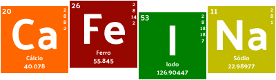

# Projeto CaFeINa




## Z1


Conversor que utiliza uma linguagem de notação chamada *z1* para desenhar estruturas de moléculas, a notação está em desenvolvimento e ainda tem alguns problemas, mas está sendo melhorada aos poucos.

O "compilador" é feito na linguagem Lua para facilitar a customização e interpretação da linguagem, e estou desenvolvendo a possibilidade de adicionar "plugins" na linguagem, por enquanto a molécula é desenhada na *Fórmula Estrutural* em arquivo __SVG__.

E está em desenvolvimento uma forma de representação 3D, por enquanto chamo de Z13 e está em fase experimental para ser renderizada utilizando __[THREE.js](https://threejs.org/)__.

Representação da molécula de __Cinamaldeído__ na linguagem Z1

```txt
@name cinamaldeído
@tag orgânico
@tag hidrocarboneto

@p benzeno 1,2,3,4,5,6,7,8,9,10,11,12
H 7
H 9
H 10
H 11
H 12

C 8 14 15
H 14
14 270°
15 =

C 15 16 17
H 16
15 30°
16 90°
17 330°

@p aldeido 17,18,19
```

Representação da molécula de __Cinamaldeído__ na convertida de Z1 para SVG

